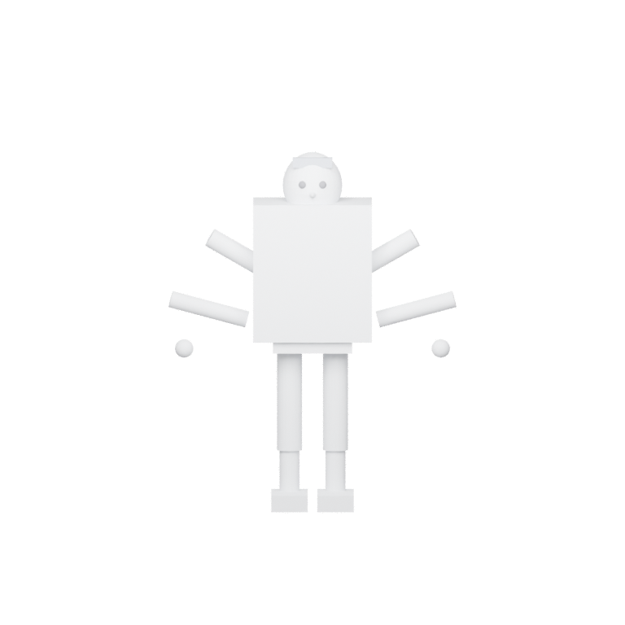
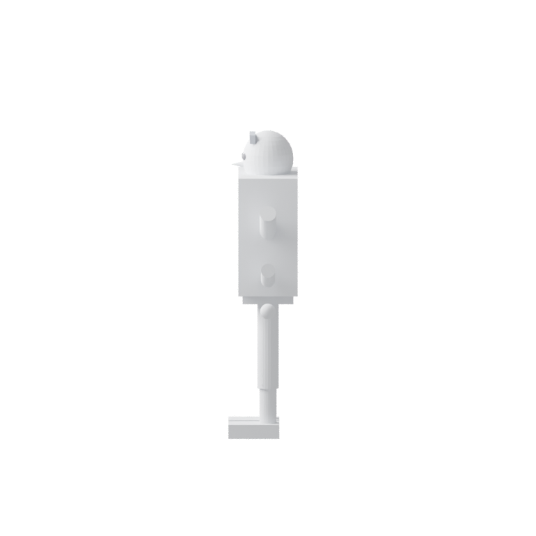
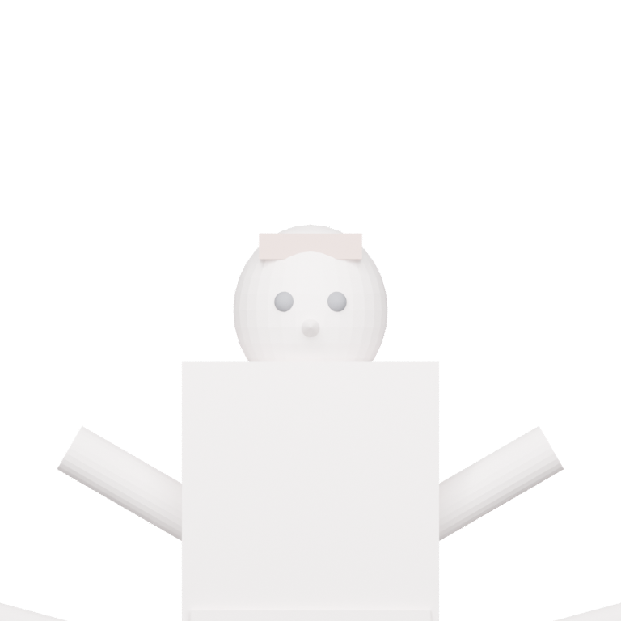
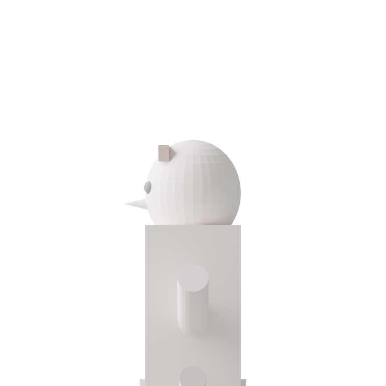

# Capture guide

Use this guide before uploading any photos. The goal is a clean, repeatable photo sweep that works for both early LoRA phases and the later higher-detail 3D phases.

## Minimum capture targets

- LoRA-ready set: 20-30 sharp photos.
- High-detail 3D set: 60-120+ sharp photos.
- Full-body distance: 3-4 meters from the subject.
- Head-pass distance: 0.8-1.2 meters from the subject.
- Overlap: keep 60-70% overlap between neighboring frames.

## Shot plan

1. Capture a full-body sweep of 12-16 photos around the subject in roughly 30-degree steps.
2. Capture a head pass of 6-8 close-ups: front, both three-quarter angles, both profiles, and extra frames if hair blocks the ears or jawline.
3. Keep the face neutral, the eyes open, and the mouth closed.
4. Keep both arms 10-15 cm away from the torso so the silhouette stays readable.
5. Pull hair back from the forehead and ears for the head pass so the hairline is visible.

## Lighting and wardrobe

- Use bright diffuse daylight or two soft lights at roughly 45 degrees.
- Wear fitted matte clothing in solid colors.
- Avoid hats, sunglasses, glossy fabrics, sequins, and loose outerwear.
- Keep every frame sharp. Motion blur and focus hunting weaken both LoRA and later reconstruction.

## Backgrounds to avoid

- Mirrors, reflective walls, and windows behind the subject
- Busy wallpaper, shelves, clutter, or other people in frame
- Deep shadows that hide the jaw, neck, armpits, or clothing outline
- Strong patterns on floors or backgrounds that compete with body edges

## High-detail 3D note

LoRA training can begin from the smaller set, but the later high-detail 3D phases need the larger set up front. Long hair, loose garments, and reflective materials often need more than the minimum because they hide or distort the silhouette.

## Reference assets

Male body front:

Male left profile:

Female face front:

Female face left:

## Tracked files

- `docs/capture_guides/assets/`
- `scripts/blender/render_capture_guides.py`
- `scripts/blender/render_capture_guides.sh`
